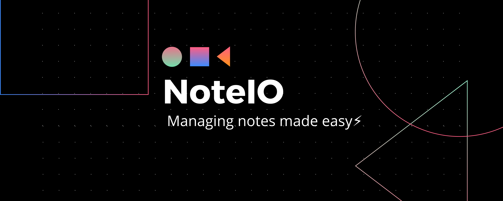

<p align="center">
   
</p>
<!-- TABLE OF CONTENTS -->
<h2 align="center">Table of Contents</h2>

- [Built With](#built-with)
- [How to Install Locally](#how-to-install-locally)
- [License](#license)

<!-- BUILT WITH -->  

<h2 align="center">Built With</h2>  

<p align="center">
   
   
</p>  

<!-- INSTALLATION -->
<h2 align="center">How to Install Locally</h2>

**1. Fork and clone this repository using**

```
  git clone https://github.com/sandip2224/NoteIO.git
  cd NoteIO
```  

**2. Install reqired dependencies and move to working directory using**

```
   npm install
   cd src
```

**3. Add a new note using**

```
   node app.js add --title="<TITLE>" --body="<NOTE-DESCRIPTION>"
```

**4. Delete an existing note using**

```
   node app.js del --title="<TITLE>"
```

**5. Explore the contents of a note using**

```
   node app.js open --title="<TITLE>"
```

**6. List out all existing notes using**

```
   node app.js logs
```

<!-- LICENSE -->  

<h2 align="center">License</h2>

Distributed under the MIT License. See `LICENSE` for more information.  
